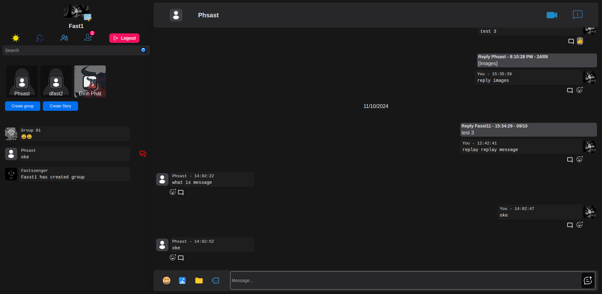

# Chat App

This is a chat application built with modern web technologies. The client side is developed using Next.js, Zustand, Tailwind CSS, and Next UI, while the server side is powered by NestJS, MongoDB, Mongoose, Socket.IO, and microservices architecture.

## Features

- Real-time messaging
- User authentication
- Responsive design
- Scalable microservices architecture

## Technologies Used

### Client Side

- **Next.js**: A React framework for server-side rendering and static site generation.
- **Zustand**: A small, fast, and scalable state-management solution.
- **Tailwind CSS**: A utility-first CSS framework for rapid UI development.
- **Next UI**: A beautiful, fast, and modern React UI library.
- **ZegoCloud**: The library supports video calling

### Server Side

- **NestJS**: A progressive Node.js framework for building efficient, reliable, and scalable server-side applications.
- **MongoDB**: A NoSQL database for storing user data and messages.
- **Mongoose**: An elegant MongoDB object modeling tool for Node.js.
- **Socket.IO**: A library for real-time web applications.
- **Microservices**: A design pattern for developing a single application as a suite of small services.
- **AWS S3 STORAGE**

## Installation

1. Clone the repository:
   ```bash
   git clone https://github.com/dphasst17/chatApp.git
   cd chatApp
   ```
2. Install dependencies for the client:
   ```bash
   cd client && bun install
   ```
3. Create env file in server and client:
   ```bash
    - client
     -> src
     ...
     -> .env
    -server
     -> api-gateway
     -> auth
     -> chat
     -> images
     -> user
     -> .env
     -> docker-compose.yml
   ```
4. Env Server:

   ```bash
   NAME=name
   PASS=passwordmongo
   DATABASE=database
   SECRET=secretkeyJWT
   AWS_ACCESS_KEY_ID=key
   AWS_SECRET_ACCESS_KEY=key
   AWS_REGION=region
   NATS_URL=nats
   PORT=port
   ```

5. Env Client:

   ```bash
   NEXT_PUBLIC_PORT=url_server
   NEXT_PUBLIC_S3=url_s3_images
   NEXT_PUBLIC_FID=facebook_id
   NEXT_PUBLIC_FSK=facebook_secret_key
   NEXT_PUBLIC_GID=google_id
   NEXT_PUBLIC_GSK=google_secret_ket
   NEXT_PUBLIC_ZEGO_APP_ID=zegocloud_id_for_video_call
   NEXT_PUBLIC_ZEGO_SERVER_SECRET=zego_server_scecret
   NEXT_PUBLIC_SK=secret_key
   NEXT_PUBLIC_K=key
   ```
6. Source Server
   ```bash
   https://github.com/dphasst17/chat-server 
   ```

## Running the Application

### Client

```bash
cd client && bun run dev
```

or build and start client with command

```bash
cd client && bun bs
```

### Server

```bash
cd server && docker compose up -d && docker compose logs -f
```

## Preview


### preview create group


### preview search


### preview chat



### preview group chat


### preview video call in group chat


